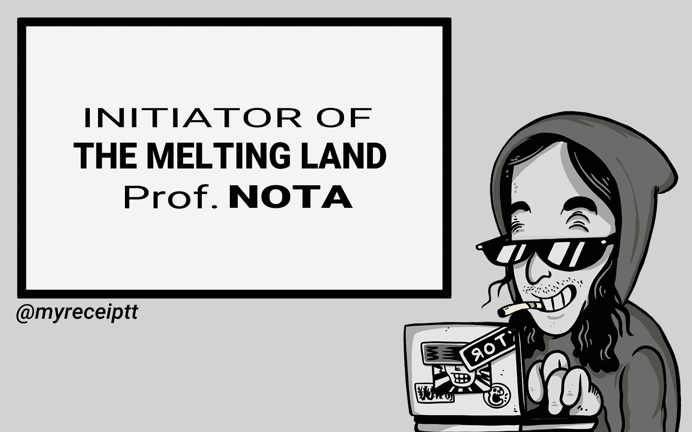

# ☕ Bagian 0

Sebelum berkenalan, [**Prof. NOTA**](https://nota.endhonesa.com/) ingin mengucapkan **terimakasih yang sebesar-besarnya** untuk semua yang sudah meluangkan waktu dan tenaganya untuk membantu mewujudkan dan mempelajari materi ini.

<figure><figcaption>
#OiOi!!!!
</figcaption></figure>

Hai, saya [**Prof. NOTA**](https://nota.endhonesa.com/)! Saya tidak termasuk dalam realitas kalian, kehidupan nyata kalian. Dalam realitas kalian, kehidupan nyata kalian, kalian hanya bisa bertemu dengan avatar [**Prof. NOTA**](https://nota.endhonesa.com/) dalam berbagai versi.

Saya adalah avatar versi 11.0, senang bertemu kalian semua di sini! Saya berharap yang terbaik untuk kalian semua saat ini.

Oya, hampir lupa...

Akun Twitter (X) [**Prof. NOTA**](https://nota.endhonesa.com/) yang lama, yaitu **@MyReceiptt** sudah tidak aktif lagi. Silahkan kunjungi dan ikuti akun Twitter (X) [**Prof. NOTA**](https://nota.endhonesa.com/) yang baru, yaitu [**@MyReceiptTT**](https://x.com/MyReceiptTT) yang menggunakan huruf T sebanyak tiga kali.

Oke, #OiOi!!!!


**Catatan**: Khusus bagi kalian yang memiliki [**token fungible**](https://nota.endhonesa.com/) maupun [**token non-fungible**](https://nota.endhonesa.com/) buatan [**Prof. NOTA**](https://nota.endhonesa.com/), kalian bisa menjumpai [**Prof. NOTA**](https://nota.endhonesa.com/) secara langsung di [**Prof. NOTA's Discord server**](https://discord.gg/5KrsT6MbFm) dan gunakan token yang kamu miliki untuk mengakses keberadaan [**Prof. NOTA**](https://nota.endhonesa.com/) di **semesta 0101** ini.


***
