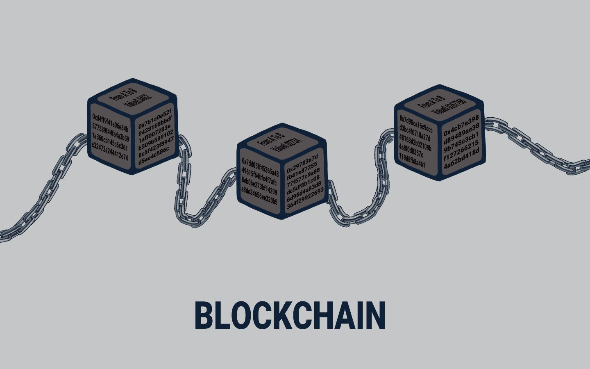

# 🔏 Bagian 1

<figure><figcaption>
Sebuah Ilustrasi Visual Tentang Blockchain
</figcaption></figure>

Blockchain sangat populer saat ini. Tapi apa itu blockchain? Bagaimana cara kerjanya, masalah apa yang dipecahkannya, dan bagaimana cara menggunakannya?

Di bagian pertama ini akan dijelaskan tentang cara kerja blockchain dan sedikit sejarah tentang teknologi blockchain.

***
