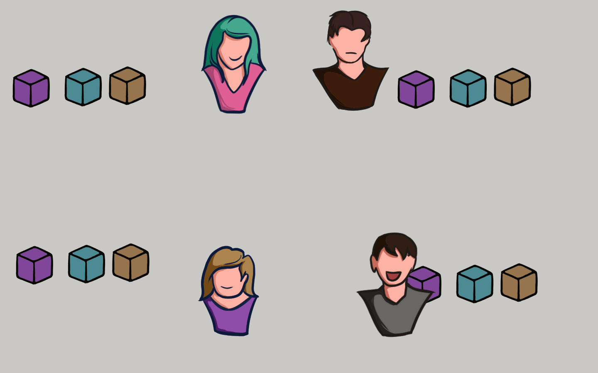

# 🔏 Blok Baru

<figure><figcaption>
Sebuah Blok Baru Tercipta
</figcaption></figure>

Sekarang mari kita lihat apa yang terjadi jika di dalam jaringan P2P sebuah blockchain ada node yang membuat blok baru.

Blok baru itu dikirim salinannya ke semua node di dalam jaringan P2P tersebut. Setiap node kemudian memverifikasi blok tersebut untuk memastikan bahwa blok tersebut valid dan belum dirusak.

Jika semuanya beres, setiap node menambahkan blok ini ke blockchain-nya.

***
