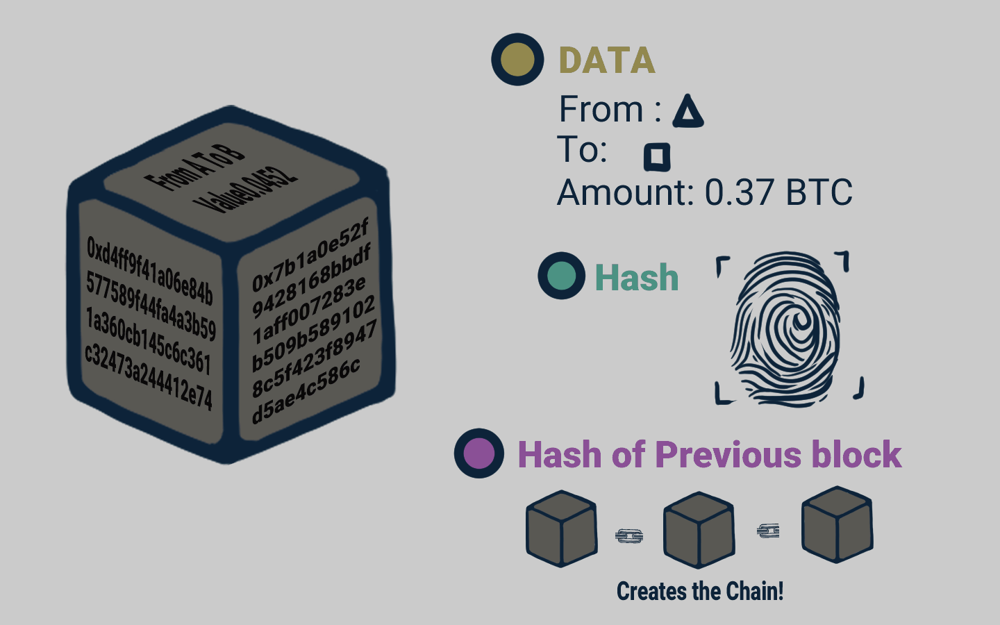

# 🔏 Data Block

<figure><figcaption>
Sebuah Blok Data
</figcaption></figure>

Di setiap blok data, di dalam blockchain, selalu berisi data, hash dari blok tersebut, dan hash dari blok sebelumnya.

Data yang disimpan di dalam blok bergantung pada jenis blockchain. Blockchain Bitcoin misalnya, selalu menyimpan detail transaksi mata uangnya (coin/koin Bitcoin) di dalam blok, seperti alamat pengirim, penerima, dan jumlah koin Bitcoin yang ditransaksikan.

Sebuah blok juga memiliki hash. Kalian dapat membandingkan hash dengan sidik jari. Hash ini mengidentifikasi sebuah blok dan seluruh isinya serta sifatnya selalu unik, benar-benar seperti sidik jari.

Ketika sebuah blok dibuat dan telah di isi data transaksi, maka proses penghitungan dilakukan untuk menentukan hash-nya. Sehingga ketika mengubah sesuatu di dalam blok akan menyebabkan hash-nya juga berubah.

Jadi dengan kata lain, hash sangat berguna ketika kalian ingin mendeteksi perubahan pada blok. Jika sidik jari suatu blok berubah, maka blok tersebut bukan lagi blok yang sama.

Elemen ketiga di dalam setiap blok adalah hash dari blok sebelumnya. Ini secara efektif menciptakan rantai blok dan teknik inilah yang membuat blockchain sangat aman.

***
