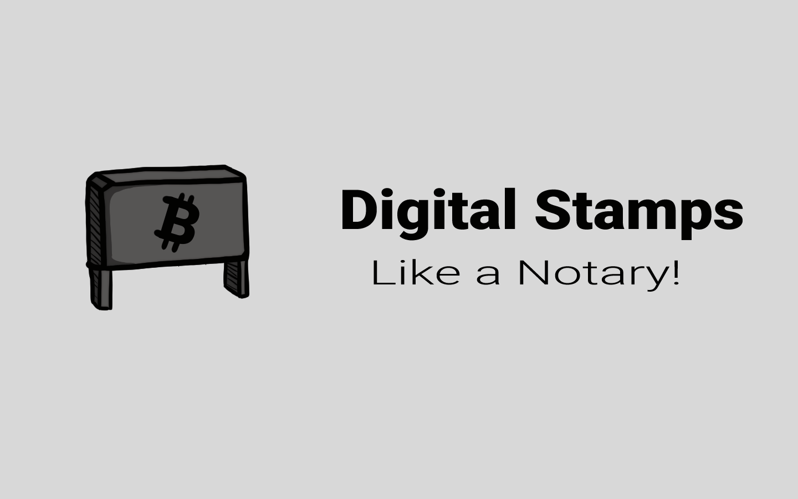

# 🔏 Digital Stamps

<figure><figcaption>
Digital Stamps
</figcaption></figure>

Sesuai dengan namanya, blockchain hanyalah rantai blok atau rangkaian blok yang berisi data dan informasi.

Teknik ini awalnya dijelaskan pada tahun 1991 oleh sekelompok peneliti. Awalnya dimaksudkan untuk memberi stempel waktu pada dokumen digital sehingga tidak mungkin untuk memundurkan tanggalnya atau mengutak-atiknya. Hampir seperti notaris!

***
