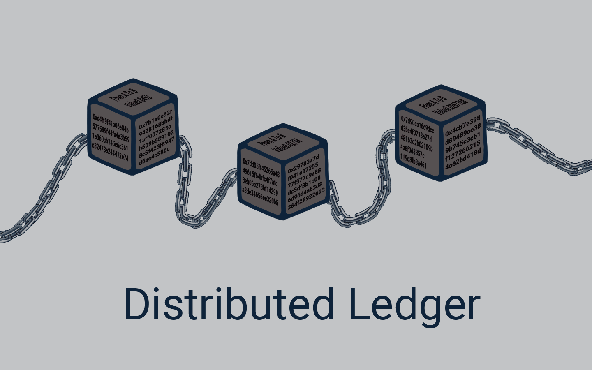

# 🔏 Distributed Ledger

<figure><figcaption>
Buku Besar Terdistribusi
</figcaption></figure>

Di Bitcoin menjadikan blockchain layaknya buku besar terdistribusi yang sepenuhnya terbuka bagi siapa saja untuk menuliskan catatan dan menyimpannya.

Blockchain ini memiliki sifat yang menarik, yaitu setelah beberapa data dicatat di dalam blockchain, akan sangat sulit untuk mengubahnya. Lalu bagaimana cara kerjanya?

Baiklah, mari kita lihat lebih dekat wujud dari sebuah blok di dalam blockchain.

***
