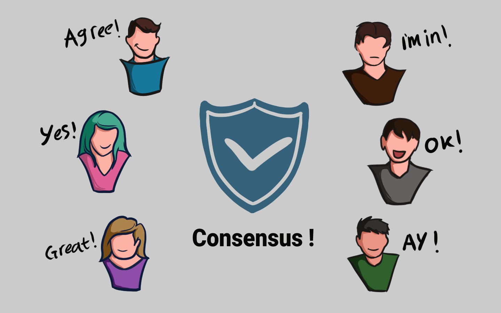

# 🔏 Konsensus

<figure><figcaption>
Konsensus!
</figcaption></figure>

Semua node yang tergabung di jaringan P2P sebuah blockchain tadi menciptakan yang namanya konsensus. Mereka sepakat tentang blok mana yang valid dan mana yang tidak. Blok yang dirusak akan ditolak oleh node lain di dalam jaringan.

Jadi, agar berhasil mengutak-atik sebuah blockchain, kalian harus mengutak-atik semua blok di dalam blockchain tersebut, mengulang mekanisme "Proof-of-Work" untuk setiap blok, dan mengendalikan lebih dari 50% node yang tergabung di jaringan P2P blockchain tersebut. Hanya dengan begitu blok yang telah dirusak dapat diterima oleh jaringan P2P blockchain tersebut.

Hal tersebut hampir mustahil dilakukan!

***
