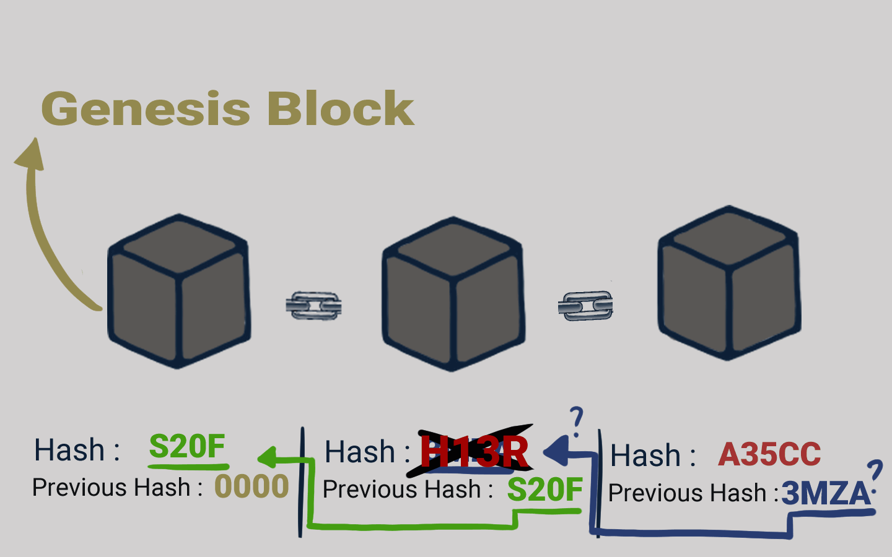

# 🔏 Merusak Rantai Blok

<figure><figcaption>
Merusak Rantai Blok
</figcaption></figure>

Sekarang katakanlah salah satu diantara kalian ada yang mengutak-atik blok nomor dua untuk mengubah data di dalamnya. Hal ini menyebabkan hash blok nomor dua juga berubah. Pada gilirannya hal ini akan membuat blok nomor tiga dan semua blok berikutnya menjadi tidak valid karena mereka tidak lagi menyimpan hash yang valid dari blok sebelumnya.

Jadi, mengubah satu blok akan membuat semua blok berikutnya menjadi tidak valid.

Namun, penggunaan hash saja tidak cukup untuk mencegah gangguan. Komputer canggih saat ini sangat cepat dan dapat menghitung ratusan ribu hash per detik.

Kalian dapat secara efektif mengutak-atik sebuah blok dan menghitung ulang semua hash dari blok lain untuk membuat blockchain yang sudah dirusak menjadi valid kembali.

***
