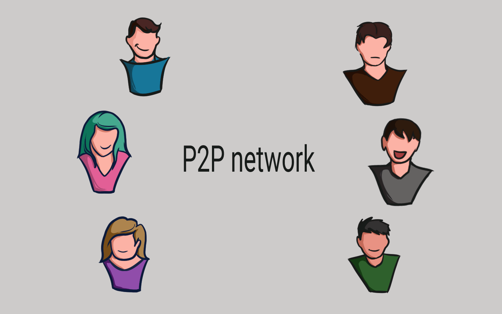

# 🔏 P2P Network

Selain pengaman blockchain dari sisi dalam, pengamanan juga dilakukan dari sisi luar blockchain itu sendiri. Tujuannya agar blockchain benar-benar dapat mengamankan dirinya sendiri dari dalam dan luar.

Pengamanan dari sisi luar itu adalah dengan cara mendistribusikan blockchain di jaringan "Peer-to-Peer" atau P2P network.

<figure><figcaption>
Jaringan Peer to Peer
</figcaption></figure>

Alih-alih menggunakan sumber daya milik entitas terpusat untuk mengelolanya, blockchain menggunakan sumber daya milik jaringan P2P, dan siapa pun yang memiliki sumber daya mencukupi diperbolehkan untuk bergabung.

Ketika seseorang menghubungkan sumber dayanya yang berupa perangkat komputer untuk bergabung dengan jaringan P2P sebuah blockchain, perangkat tersebut mendapatkan salinan lengkap dari blockchain tersebut.

Perangkat ini biasa disebut sebagai node dan node ini dapat menggunakan jaringan P2P ini untuk memverifikasi bahwa semua data dari blockchain yang telah disalinnya masih beres (valid dan tidak dirusak).

***
