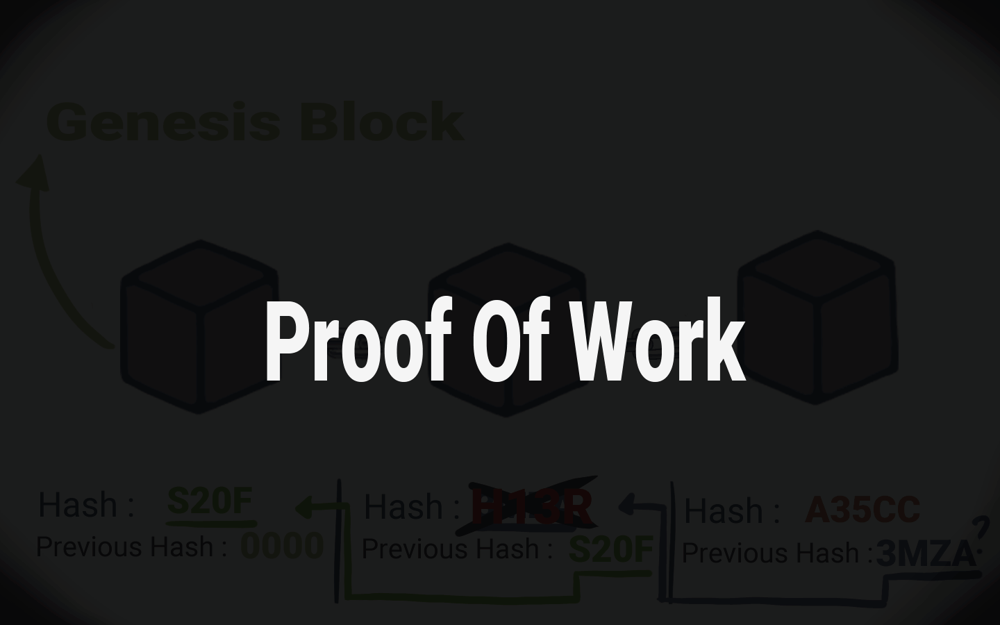
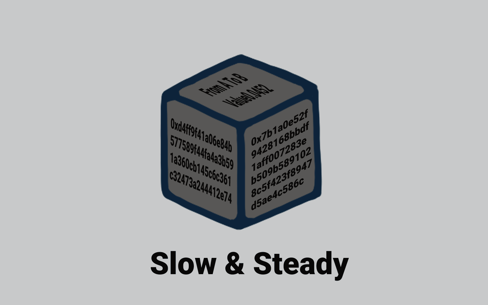

# 🔏 Proof of Work

<figure><figcaption>
Proof of Work
</figcaption></figure>

Untuk mengurangi resiko gangguan tersebut, blockchain memiliki sesuatu yang disebut "Proof-of-Work".

<figure><figcaption>
Pelan tapi Pasti
</figcaption></figure>

Ini adalah mekanisme yang memperlambat pembuatan blok baru. Menjadikan proses pembuatan dan merangkai rantai blok menjadi lebih lambat tapi pasti.

***
