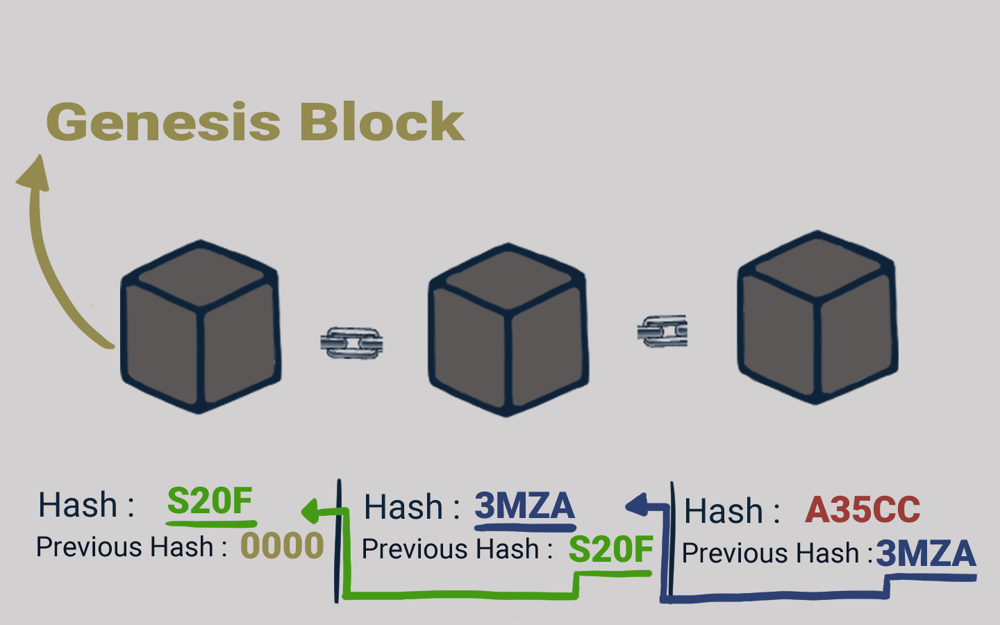

# 🔏 Rantai Blok

<figure><figcaption>
Rantai Blok
</figcaption></figure>

Mari kita simulasikan dengan contoh rantai blok di atas.

Di sini kita memiliki rantai dengan tiga blok. Seperti yang kalian lihat, setiap blok memiliki hash-nya sendiri dan hash dari blok sebelumnya. Jadi blok nomor tiga menunjuk ke blok nomor dua dan blok nomor dua menunjuk ke blok nomor satu.

Nah, blok yang nomor satu agak spesial. Blok nomor satu tidak bisa menunjuk ke blok sebelumnya karena ini blok pertama. Blok pertama ini disebutnya sebagai blok genesis.

***
