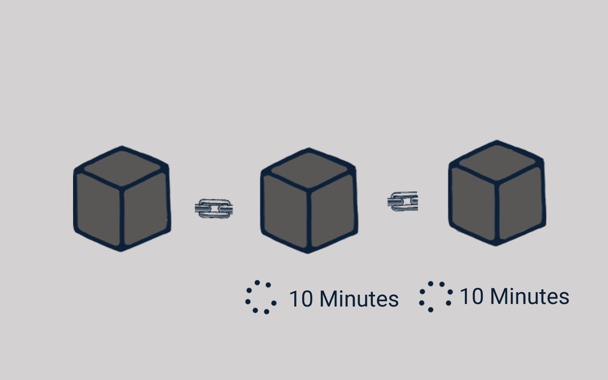

# 🔏 Sepuluh Menit

<figure><figcaption>
10 Menit untuk Setiap Blok
</figcaption></figure>

Dalam blockchain Bitcoin, dibutuhkan sekitar sepuluh menit untuk menghitung "Proof-of-Work" yang diperlukan dan menambahkan blok baru ke rantai blok.

Mekanisme ini membuat siapa saja menjadi sangat kesulitan untuk mengutak-atik blok. Jika salah satu diantara kalian mencoba mengutak-atik sebuah blok, maka harus menghitung ulang "Proof-of-Work" untuk semua blok berikutnya.

Jadi, keamanan blockchain berasal dari penggunaan secara kreatif dari proses penghitungan hash (hashing) dan mekanisme "Proof-of-Work".

Proses dan mekanisme di blockchain tersebut juga biasa disebut dengan istilah protokol blockchain. Saat ini ada banyak sekali jenisnya, contohnya "Proof-of-Stake", "Proof-of-History", Parachains, Dll.

***
