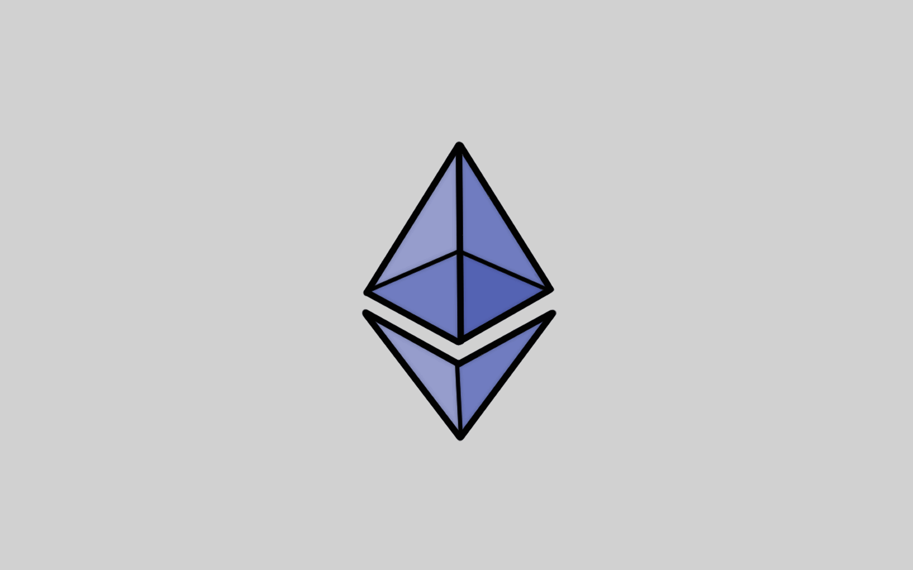

# 📜 Bagian 2

Sekarang kalian sudah tahu apa itu blockchain, bagaimana cara kerjanya secara mendasar, dan masalah apa yang dipecahkannya.

Namun, teknologi blockchain masih terus berkembang dan salah satu perkembangan yang revolusioner adalah penciptaan blockchain Ethereum dan smart contract.

Di bagian kedua ini akan dijelaskan tentang apa itu smart contract dan sedikit konsep dasar dari blockchain Ethereum.

<figure><figcaption>
Blockchain Ethereum - Blockchain 2.0
</figcaption></figure>

Ethereum diciptakan pada tahun 2013 oleh programmer Vitalik Buterin. Ini adalah perangkat lunak sumber terbuka (open source).

Ethereum adalah blockchain terdesentralisasi yang dibangun di jaringan P2P. Ethereum juga disebut sebagai platform blockchain yang mampu mengeksekusi dan memverifikasi kode aplikasi dengan aman, yang disebut smart contract.

Smart contract memungkinkan siapa saja menentukan berbagai kondisi untuk mentransaksikan Ether secara otomatis tanpa perlu adanya otoritas pusat yang dipercaya (third-party).


**Catatan**: **Ether** adalah mata uang kripto asli platform **Ethereum**. Di antara mata uang kripto, **Ether** berada di urutan kedua setelah **Bitcoin** dalam kapitalisasi pasar.


***
