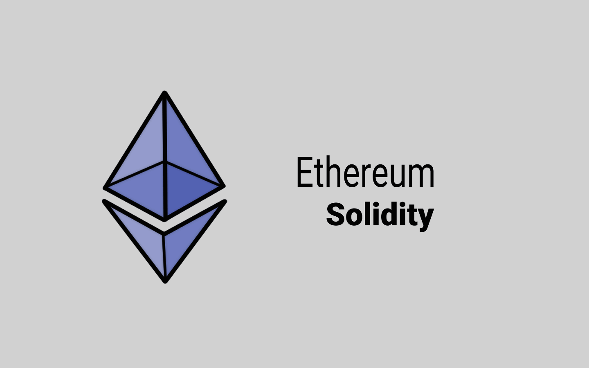

# 📜 Blockchain Ethereum

<figure><figcaption>
Bahasa Solidity di Blockchain Ethereum
</figcaption></figure>

Saat ini ada banyak blockchain yang mendukung smart contract, tapi yang terbesar adalah Ethereum. Ethereum secara khusus dibuat dan dirancang untuk mendukung fungsionalitas dari smart contract. Smart contract di Ethereum dapat ditulis atau diprogram dalam bahasa pemrograman khusus yang disebut Solidity.

Perlu dicatat bahwa Bitcoin juga memiliki dukungan untuk smart contract meskipun sangat terbatas jika dibandingkan dengan Ethereum.

Dari sini saya akan membantu kalian memahami serangkaian pedoman standar teknis untuk membuat smart contract sehingga bisa kalian gunakan dan jalankan di Ethereum.

***
