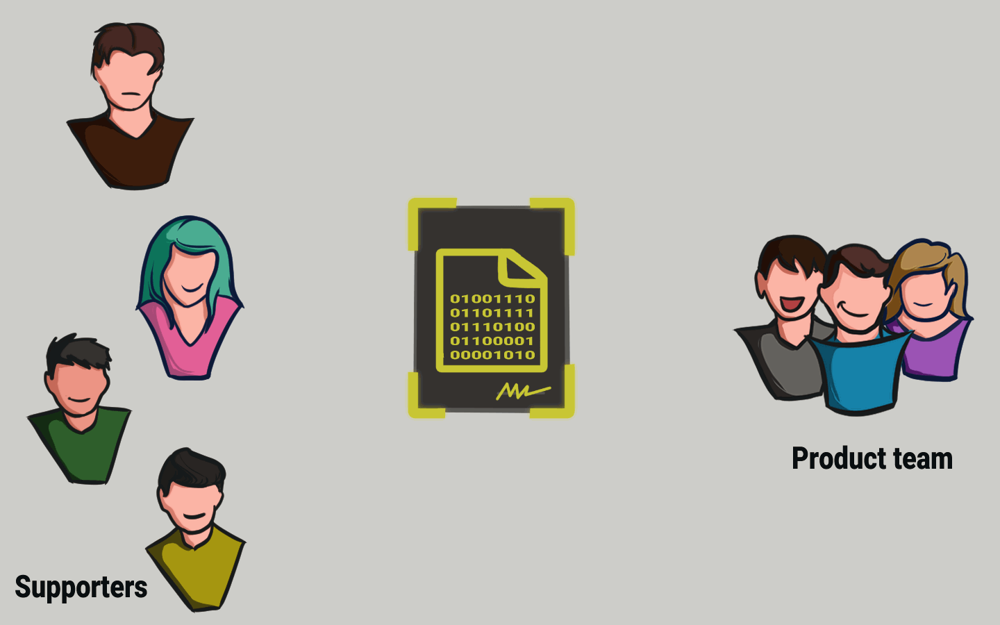

# 📜 Crowdfunding Contract

<figure><figcaption>
Crowdfunding Smart Contract
</figcaption></figure>

Kita dapat memprogram sebuah smart contract sehingga dapat menampung semua dana yang diterima hingga target nominal tertentu tercapai. Pendukung suatu proyek sekarang dapat mentransfer uang mereka ke smart contract tersebut.

Jika proyek mendapat pendanaan penuh, smart contract secara otomatis meneruskan uang tersebut kepada tim proyek.

Jika proyek gagal mencapai target nominal pendanaannya, uang di dalam smart contract secara otomatis kembali ke pendukungnya.

<figure><figcaption>
Project Failed
</figcaption></figure>

Cukup mengagumkan bukan!?!?

Dan karena smart contract disimpan di blockchain, semuanya terdistribusi sepenuhnya. Dengan teknik ini, tidak ada seorang pun yang bisa mengendalikan uang.

Tapi tunggu sebentar! Mengapa kita harus mempercayai smart contract?

***
