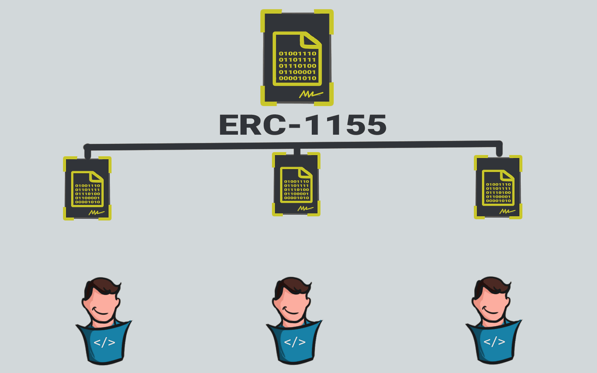
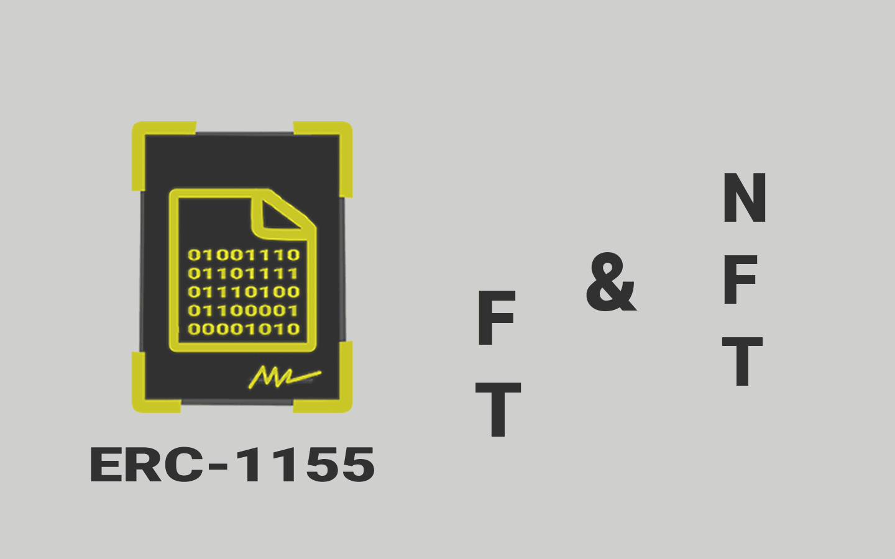
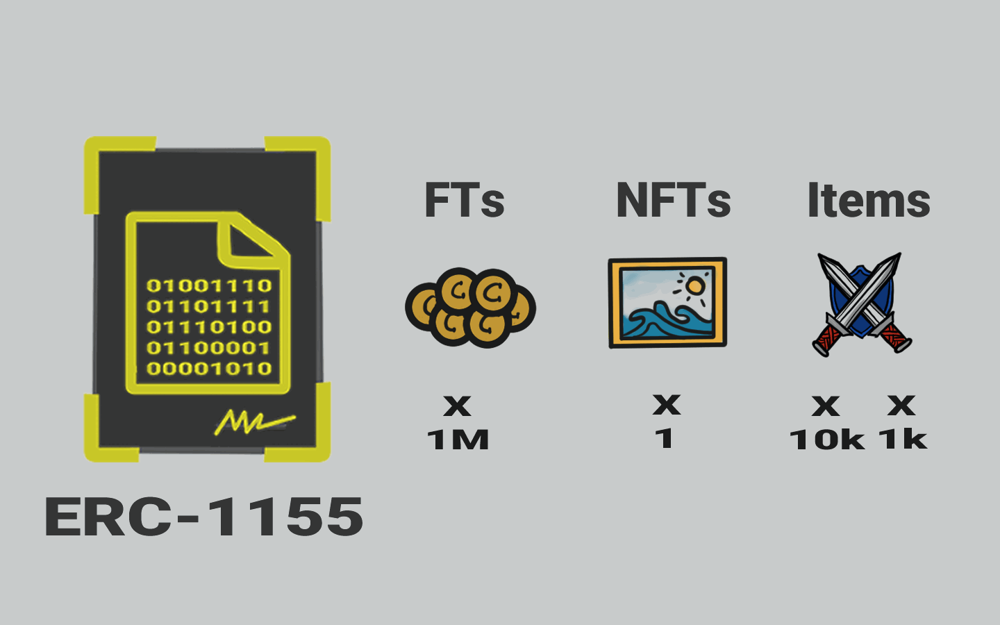
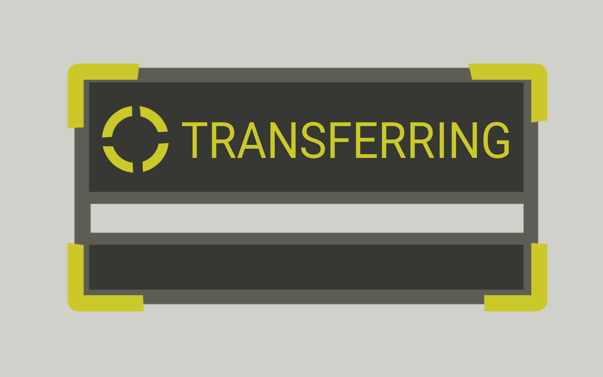

# 📜 ERC1155

<figure><figcaption>
Smart Contract ERC1155
</figcaption></figure>

Sekarang mari kita bicara tentang ERC1155.

Standar ERC1155 ini merupakan kombinasi dari ERC20 dan ERC721. Smart contract ERC1155 memiliki token tetapi tidak didistribusikan. Setiap token memiliki jenis kontraknya sendiri.

Jadi setiap token adalah sebuah item dan memiliki persediaannya/pasokannya sendiri. Pasokannya (supply) kemudian didistribusikan kepada pemiliknya.

Itulah sebabnya kalian dapat membuat (mencetak) fungible token dan non-fungible token menggunakan satu smart contract ERC1155 saja.

<figure><figcaption>
FT dan NFT - ERC1155
</figcaption></figure>

<figure><figcaption>
ERC1155 Untuk Game
</figcaption></figure>

Tapi mengapa kita ingin melakukan hal tersebut?

Industri terbesar di mana smart contract ERC1155 ramai digunakan adalah industri game. Dalam sebuah game, setiap pemain atau player akan memiliki semacam mata uang dalam game dan ini adalah fungible token (FT - dapat dipertukarkan). Selain itu, setiap pemain juga memiliki item berbeda di dalam game, seperti baju besi dan senjata, ini adalah non-fungible token (NFT - tidak dapat dipertukarkan).

Semua token tersebut dibuat (dicetak) menggunakan smart contract ERC1155 yang sama sehingga memudahkan pembuatan game tersebut.

<figure><figcaption></figcaption></figure>

Smart contract ERC1155 tidak terbatas penggunaannya hanya pada industri game saja. Ada banyak kasus penggunaan lain dan banyak potensi untuk mengimplementasikan smart contract ERC1155.

<figure><figcaption>
Fungsi Transfer di ERC1155
</figcaption></figure>

Sebab, selain fungsi di atas...

Smart contract ERC1155 memungkinkan transfer beberapa atau bahkan berbagai jenis token secara bersamaan dalam satu transaksi. Hal ini sangat mengurangi kepadatan lalu lintas transaksi di dalam jaringan dan menghemat penggunaan gas fee (biaya transaksi).

Smart contract ERC1155 juga memiliki fungsi aturan transfer yang aman, yang pada prosesnya fungsi tersebut  memverifikasi setiap transaksi dan jika ada yang gagal maka transaksi dapat dibatalkan, dan mengembalikan token ke pengirim.

<figure><figcaption>
Antah Berantah Blockchain
</figcaption></figure>

Semua itu akan mencegah pengiriman token ke alamat tidak bertuan (antah berantah blockchain) ketika kalian salah mengetik alamat penerima.

Jadi sekarang kalian sudah paham apa itu ERC, apa itu ERC20, ERC721, ERC1155, dan digunakan untuk apa dalam membuat smart contract di blockchain Ethereum.

Semoga ilustrasi animasi di slide terakhir ini tidak membuat kepala kita semakin pusing dan berputar.

***
