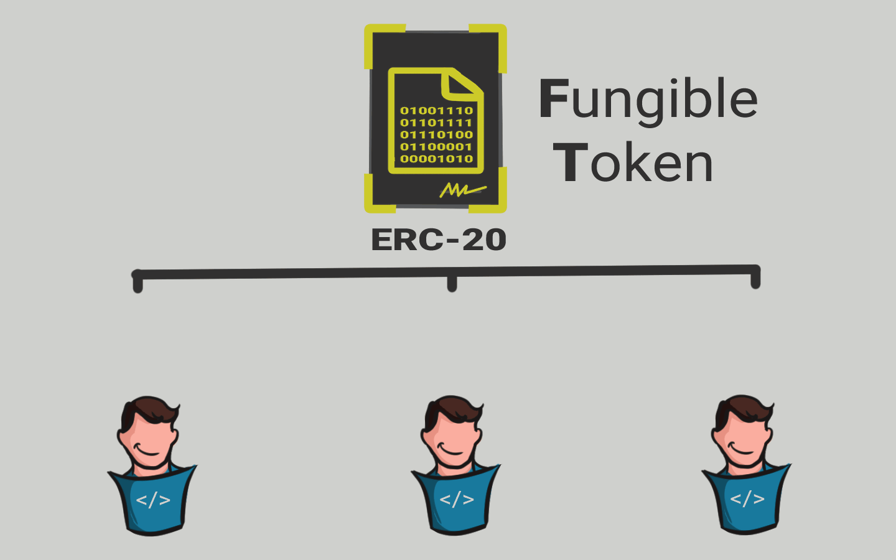
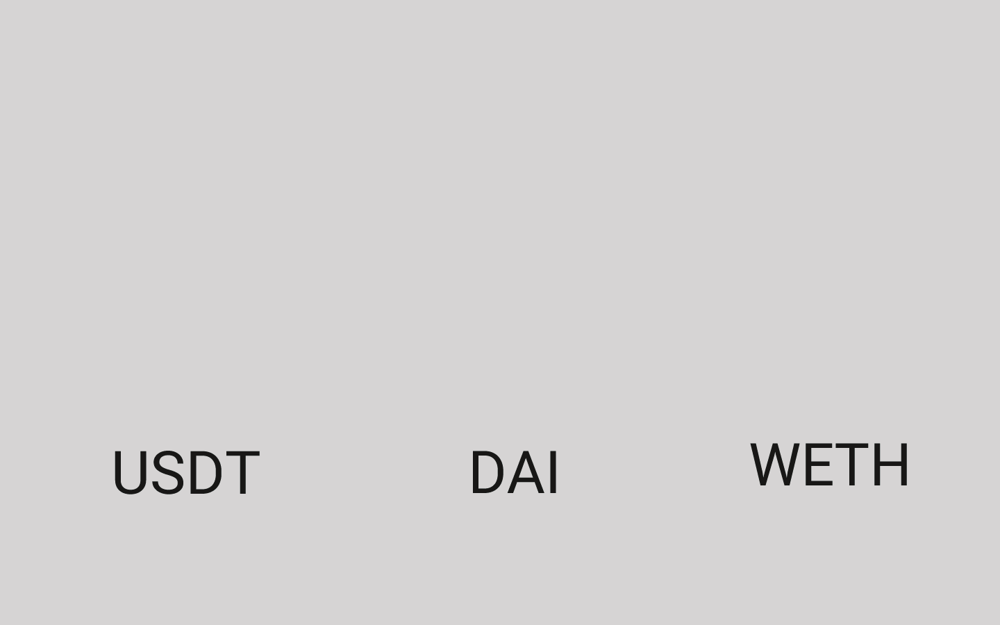

# 📜 ERC20

<figure><figcaption>
ERC20
</figcaption></figure>

Standar ERC20 ini pertama kali diusulkan pada tahun 2015 dan diintegrasikan ke dalam blockchain Ethereum pada tahun 2017.

ERC20 bertanggung jawab untuk membuat (mencetak) token, mengelola transaksi token, dan melacak saldo setiap pemegang token.

Smart contract ERC20 dapat mencetak jutaan token dan didistribusikan ke pemiliknya. Kalian dapat memiliki banyak token dari smart contract ERC20. Semua token tersebut memiliki nilai yang sama dan dapat dipertukarkan. Token tersebut adalah fungible token (FT) yang dapat saling ditukarkan seperti mata uang fiat.

Berikut ini beberapa contoh token dengan smart contract ERC20, diantaranya adalah USDT, DAI, WETH, Dll.

<figure><figcaption>
Contoh Token ERC20
</figcaption></figure>

***
