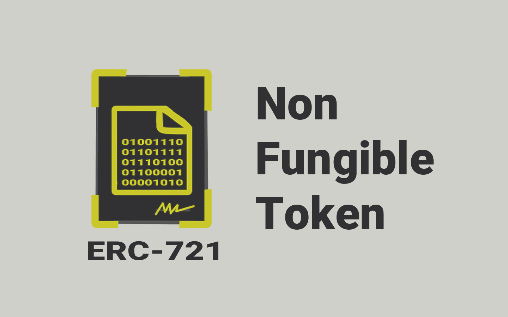
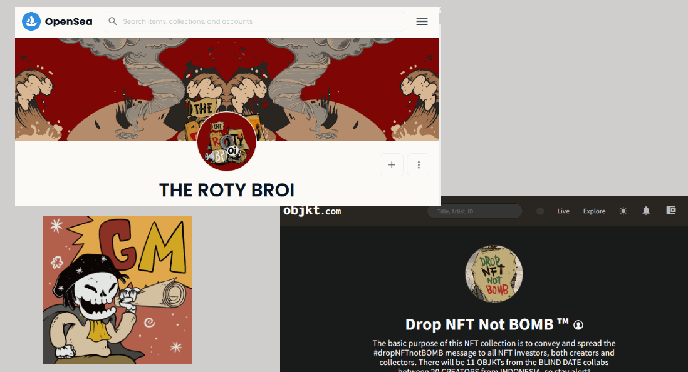

# 📜 ERC721

<figure><figcaption>
Smart Contract ERC721
</figcaption></figure>

Standar ERC721 ini mirip dengan ERC20. Smart contract ERC721 juga dapat membuat (mencetak) token sebanyak yang kalian inginkan, dan mendistribusikannya, kalian juga dapat memiliki banyak token dari smart contract ERC721. Perbedaannya adalah smart contract ERC721 memiliki fungsi tambahan yang berisi metadata (data dari sebuah data).

Jadi, setiap token dari smart contract ERC721 dapat memiliki properti unik, sehingga menjadikan setiap token berbeda antara satu dan yang lainnya. Setiap token tidak dapat ditukar dengan token lainnya karena propertinya tidak ada yang sama.

Itulah sebabnya ERC721 telah menjadi standar emas untuk non-fungible token atau untuk smart contract koleksi NFT.

Berikut ini beberapa contoh koleksi NFT dengan smart contract ERC721, diantaranya ada CryptoPunk, The ROTY BROI, Drop NFT Not BOMB, Bored Ape Yacht Club, dll.

<figure><figcaption>
Contoh Koleksi NFT Dengan Smart Contract ERC721
</figcaption></figure>

***
