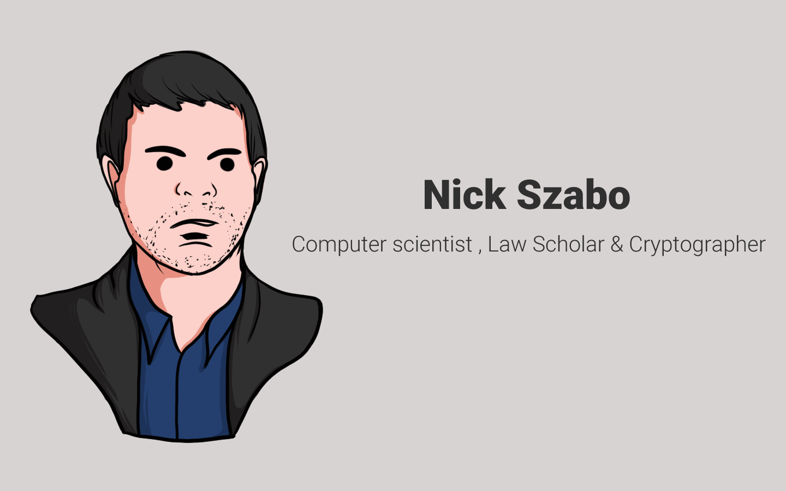

# 📜 Nick Szabo

<figure><figcaption>
Nick Szabo
</figcaption></figure>

Istilah “smart contract” pertama kali digunakan oleh Nick Szabo pada tahun 1997, jauh sebelum Bitcoin diciptakan. Nick Szabo adalah seorang ilmuwan komputer, sarjana hukum, dan kriptografer.

Saya akan memberi tahu kalian kata-katanya yang sebenarnya secara lebih sederhana, yaitu Nick Szabo pada waktu itu ingin menggunakan buku besar yang didistribusikan (blockchain) untuk menyimpan kontrak (smart contract).

***
