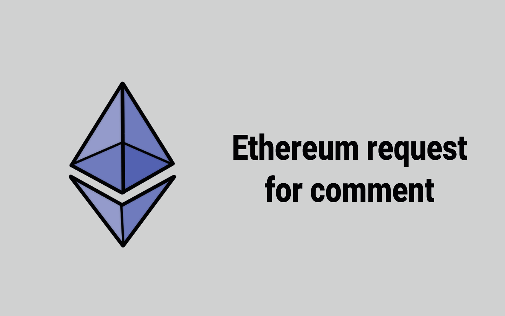
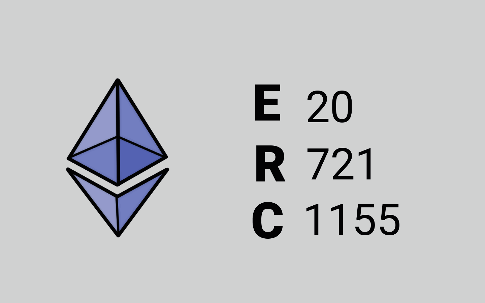

# 📜 Pedoman Teknis

<figure><figcaption>
ERC - Ethereum Request for Comment
</figcaption></figure>

Yang pertama adalah "Ethereum Request for Comment" atau disingkat ERC. ERC adalah standar atau pedoman penulisan program dengan Solidity yang harus diikuti oleh semua smart contract yang berjalan di blockchain Ethereum.

<figure><figcaption>
Smart Contract Populer Untuk Token
</figcaption></figure>

Yang kedua adalah standar smart contract di Ethereum yang paling populer, yaitu ERC20, ERC721, dan ERC1155. Semoga kalian tidak bingung membedakan ketiganya dan semoga penjelasan saya berikut ini juga semakin tidak membingungkan kalian.

***
