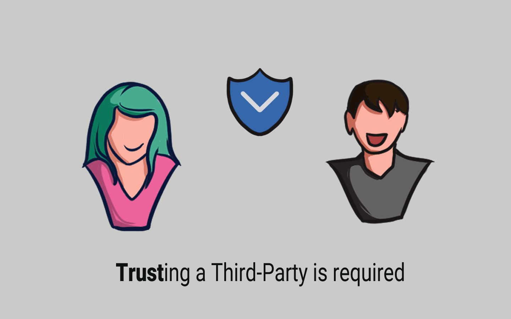

# 📜 Pihak Ketiga

<figure><figcaption>
Third-Party is Required
</figcaption></figure>

Kickstarter pada dasarnya adalah pihak ketiga yang berada di antara tim produk dan pendukung. Artinya kedua pihak harus mempercayai Kickstarter untuk menangani uang mereka dengan benar.

Jika proyek berhasil didanai, tim proyek mengharapkan Kickstarter memberikan kepada mereka uangnya. Di sisi lain, para pendukung menginginkan uang mereka disalurkan ke proyek jika proyek tersebut didanai atau mendapatkan pengembalian dana ketika proyek tersebut tidak berhasil mencapai target nominal pendanaannya.

Baik tim proyek maupun pendukungnya harus mempercayai Kickstarter. Namun dengan smart contract, kita dapat membangun sistem serupa yang tidak memerlukan pihak ketiga seperti Kickstarter.

Mari sekarang kita simulasikan sebuah smart contract untuk hal ini!

***
