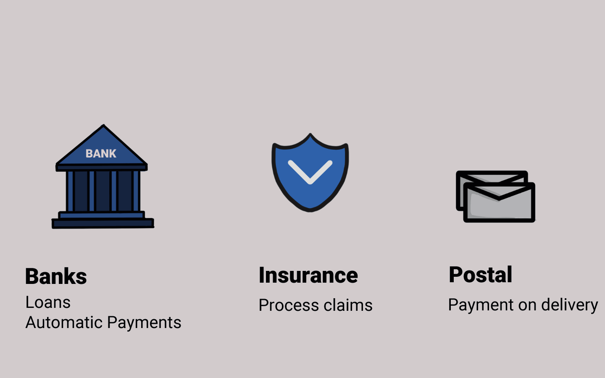

# 📜 Potensi Penerapan

<figure><figcaption>
Penerapan Smart Contract
</figcaption></figure>

Smart contract dapat diterapkan tidak hanya untuk penggalangan dana saja. Banyak sekali potensi penerapan smart contract untuk keperluan lainnya.

Hal ini membuat teknologi blockchain menarik minat banyak orang. Dalam waktu yang tidak lama, banyak sekali orang menyadari bahwa teknologi ini dapat digunakan untuk berbagai hal di keseharian kita.

Bank dapat menggunakannya untuk mengeluarkan pinjaman atau menawarkan pembayaran otomatis. Perusahaan asuransi dapat menggunakannya untuk memproses klaim tertentu. Perusahaan pos dapat menggunakannya untuk pembayaran pengiriman.

Selain itu, dunia kedokteran juga bisa mencatat dan menyimpan rekam medis kita dengan aman, lalu kita bisa membuat notaris digital, institusi pajak bisa menggunakannya untuk memungut pajak otomatis, dan lain sebagainya.

Jadi sekarang kalian tahu apa itu smart contract dan masalah apa yang dipecahkannya. Selain itu, sekarang kalian mungkin bertanya-tanya, di mana dan bagaimana kita dapat menggunakan kontrak pintar...?!?!

***
