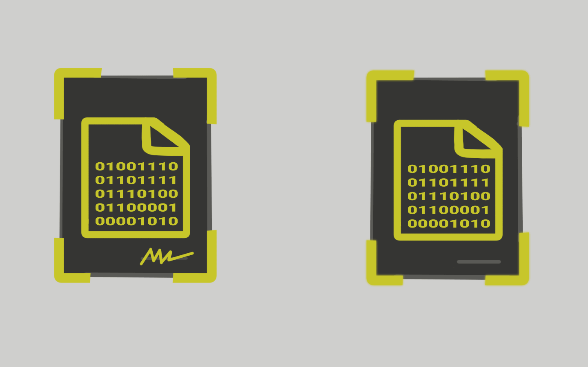
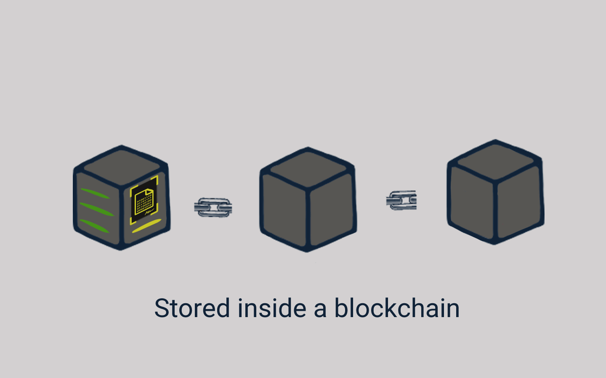

# 📜 Sebuah Kontrak

<figure><figcaption>
Kontrak yang Sepenuhnya Digital
</figcaption></figure>

Nah, sekarang bisa saya sampaikan bahwa smart contract itu sama seperti kontrak di dunia nyata. Satu-satunya perbedaan adalah semuanya digital.

Di dalam smart contract ada fungsi-fungsi sederhana hubungan "jika" dan "maka" sama seperti di sebuah kontrak yang berisi kesepakatan hubungan yang saling bertukar "hak" dan "kewajiban".

<figure><figcaption>
Smart Contract disimpan di Blockchain
</figcaption></figure>

Jika, kontrak di dunia nyata di simpan di dalam map atau lemari arsip tapi nomor kontraknya di catat di buku besar inventarisasi.

Maka, sama halnya dengan smart contract yang berupa barisan code program sederhana yang dicatat, disimpan, dan dijalankan di dalam blockchain.

Tentunya juga ada nomor untuk mengidentifikasi smart contract tersebut, yaitu alamat (address) dari smart contract tersebut.

Mari kita lihat contoh berikut ini untuk memahami cara kerja smart contract.

***
