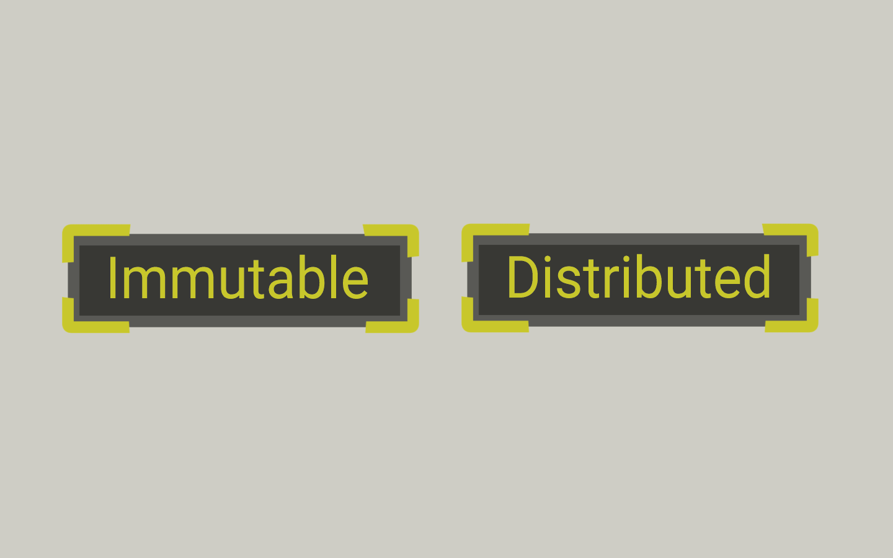
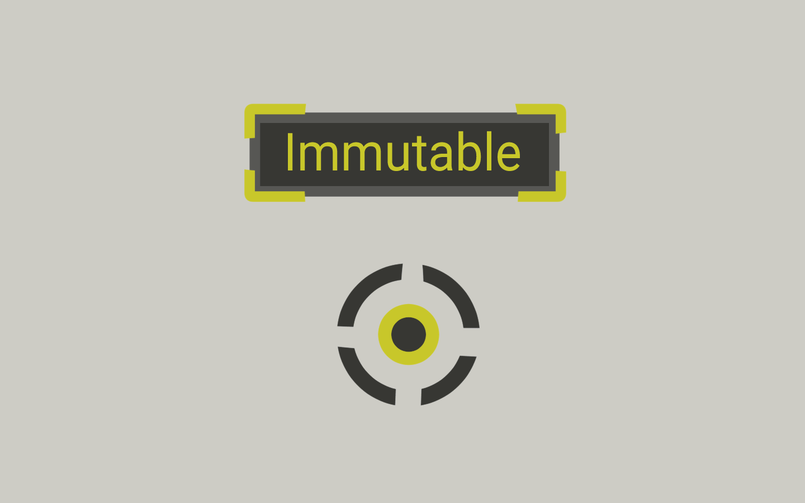
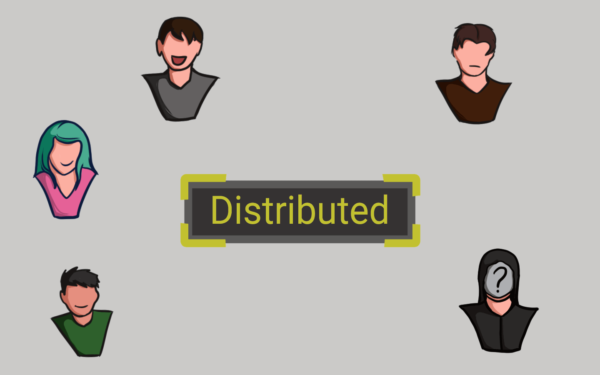

# 📜 Sifat Smart Contract

<figure><figcaption>
Immutable + Distributed
</figcaption></figure>

Nah, karena smart contract disimpan di blockchain, jadinya memiliki beberapa sifat menarik dari blockchain tersebut, yaitu bersifat tidak dapat diubah dan didistribusikan.

<figure><figcaption>
Immutable
</figcaption></figure>

Smart contract bersifat tidak dapat diubah, itu berarti bahwa setelah smart contract dibuat, maka smart contract tersebut tidak akan pernah dapat diubah lagi. Sehingga tidak ada seorang pun yang bisa pergi ke belakang kita dan merusak kode smart contract kita.

<figure><figcaption>
Distributed
</figcaption></figure>

Smart contract juga bersifat didistribusikan, ini berarti apa yang dijalankan atau dieksekusi oleh smart contract kita akan divalidasi oleh semua node di jaringan P2P blockchain.

<figure><figcaption>
Protokol Konsensus
</figcaption></figure>

Hal ini menjadikan seseorang atau node tidak dapat memaksa smart contract untuk mengeluarkan dana karena node lain di jaringan P2P akan melihat upaya ini dan menandainya sebagai upaya yang tidak valid. Merusak, atau mengubah smart contract menjadi hampir mustahil.

Di sini bisa disimpulkan, bahwa smart contract adalah bagian belakang atau back end dari aplikasi terdistribusi atau aplikasi terdesentralisasi (decentralized application).

***
