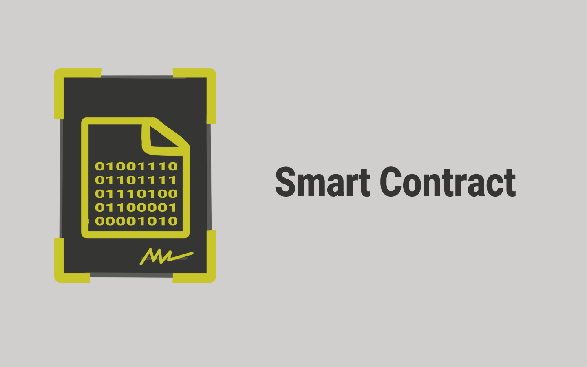

# 📜 Smart Contract

<figure><figcaption>
Smart Contract
</figcaption></figure>

Sejak digunakan di blockchain Ethereum, smart contract sangat populer penggunaannya hingga saat ini. Terus, apa sebenarnya smart contract ini?!?!

Sebenarnya smart contract itu adalah program (software/perangkat lunak) sederhana yang disimpan di blockchain dan digunakan secara otomatis berdasarkan kondisi tertentu untuk mengelola (mentransaksikan, menukarkan, memantau, dll.) semua mata uang (coin/koin) yang digunakan dan beredar di blockchain.

Tapi, program yang seperti apa dan masalah apa yang dipecahkan? Mari kita pelajari bersama-sama!

***
