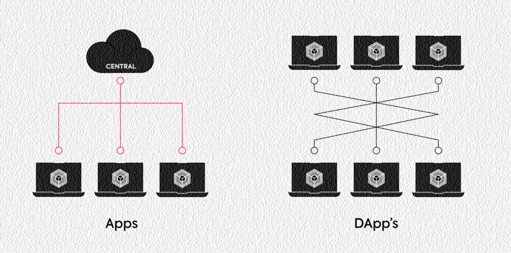

# 📜 App dan DApp

<figure><figcaption>
Apps Versus DApps
</figcaption></figure>

Jadi, apa itu dApp?

Kalau application pada umumnya menggunakan jaringan komputer server terpusat (dimiliki oleh satu pihak) untuk menyimpan data dan mengeksekusi kode programnya, berbeda halnya dengan decentralized application yang menggunakan jaringan P2P yang terdesentralisasi, seperti jaringan blockchain, dan menggunakan satu atau lebih smart contract untuk menjalankan operasi di sisi back end-nya.

***
