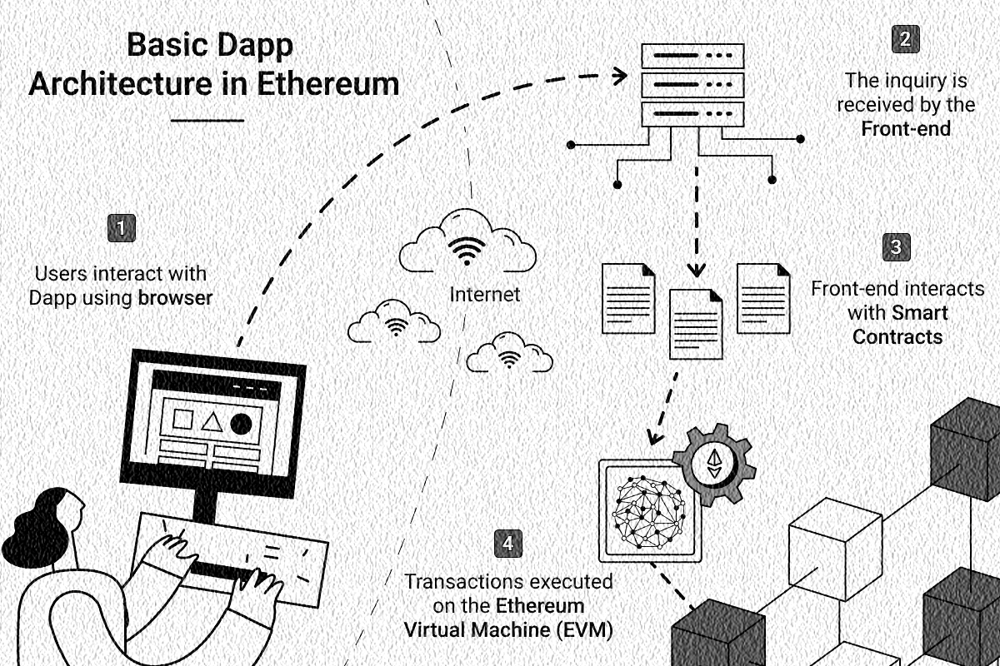

# 📜 DApp Di Ethereum

<figure><figcaption>
Dapp di Ethereum
</figcaption></figure>

Ilustrasi di atas adalah gambaran secara mendasar bagaimana sebuah decentralized application berjalan di atas blockchain Ethereum.

Secara sederhana, proses di atas bisa saya jelaskan sebagai berikut:

1. Pengguna berinteraksi dengan sebuah dApp. Interaksi ini bisa berupa input data atau bisa juga hanya memberikan sebuah kondisi. Biasanya melalui sebuah perambah (browser) website.
2. Interaksi ini kemudian diterima dan diproses oleh bagian depan (front end) dApp, yaitu segala apa yang bisa mengerti oleh pengguna (manusia), biasanya menyertakan elemen visual seperti tombol, kotak centang, grafik, dan pesan teks.
3. Selanjutnya front end berinteraksi dengan bagian belakang (back end) dApp, yaitu smart contract sehingga data atau kondisi yang diterima bisa diproses oleh fungsi-fungsi yang sudah ditentukan dalam smart contract.
4. Proses yang dilakukan oleh smart contract, yaitu berupa transaksi-transaksi dieksekusi oleh smart contract di jaringan blockchain Ethereum sekaligus dicatat di dalam blockchain tersebut.

Hal yang menarik di sini adalah sifat desentralisasi blockchain Ethereum tersebut yang memberikan peningkatan keamanan, transparansi, dan otonomi pada decentralized application yang berjalan di atasnya.

***
